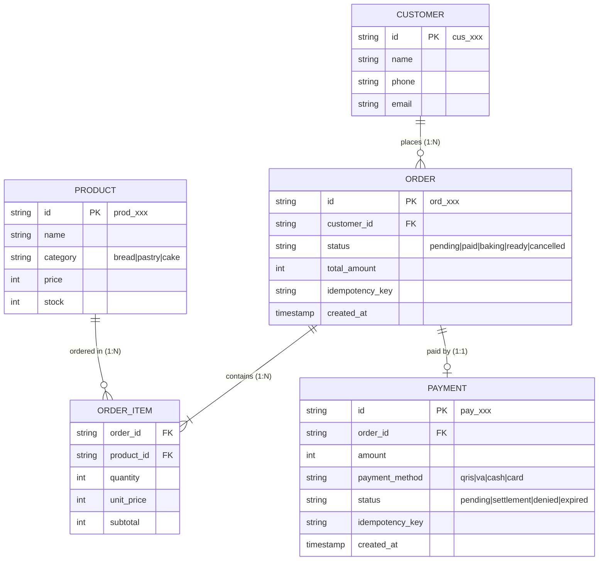

# Rencana & Solusi Latihan Diskusi: Desain RESTful API Toko Roti
**Mata Kuliah:** Integrasi Aplikasi Korporasi (Pertemuan 6)  
**Topik:** RESTful API Design & OpenAPI (Belajar dari Stripe & Midtrans)  
**Tema Studi Kasus:** Sistem Pemesanan & Pembayaran Toko Roti (*Artisan Bakery*)

---

## 1. Pemetaan Resource ke Gaya Stripe & Analisis Idempotency-Key

### A. Prinsip Desain ala Stripe
Mengacu pada materi kuliah (Slide 5):
1. **Kata benda jamak (Plural nouns):** Menggunakan `/customers`, `/products`, `/orders`, `/payments` (Bukan gaya RPC seperti `/getCustomer` atau `/createOrder`).
2. **ID Berprefiks:** Memudahkan identifikasi tipe objek secara langsung:
   - Customer: `cus_...` (contoh: `cus_bakery_9a8b1c`)
   - Product: `prod_...` (contoh: `prod_sourdough_01`)
   - Order: `ord_...` (contoh: `ord_20260925_x7k2`)
   - Payment: `pay_...` (contoh: `pay_trx_88f1a2`)
3. **Nesting Dangkal (Shallow Nesting):** Menghindari hierarki URL terlalu dalam seperti `/customers/{id}/orders/{id}/payments`. Relasi diakses langsung via top-level resource dengan query parameter filter (misal: `GET /v1/orders?customer=cus_...`).
4. **Aksi Non-CRUD sebagai Sub-path:** Aksi status/transisi bisnis dimodelkan dengan sub-path kata kerja di akhir (contoh: `/v1/orders/{id}/cancel`, `/v1/payments/{id}/confirm`).

---

### B. Pemetaan Endpoint Resource Toko Roti

| HTTP Method | Endpoint | Deskripsi Fungsi | Status Code Sukses | Wajib Idempotency-Key? |
| :--- | :--- | :--- | :--- | :---: |
| `POST` | `/v1/customers` | Mendaftarkan pelanggan baru toko roti | `201 Created` | Opsional |
| `GET` | `/v1/customers/{id}` | Mengambil data profil pelanggan | `200 OK` | Tidak (Idempotent bawaan) |
| `GET` | `/v1/products` | Menampilkan katalog roti & kue (stok, harga) | `200 OK` | Tidak |
| `GET` | `/v1/products/{id}` | Detail roti spesifik | `200 OK` | Tidak |
| `POST` | `/v1/orders` | Membuat pesanan baru & **mereservasi stok roti** | `201 Created` | **WAJIB** |
| `GET` | `/v1/orders` | Menampilkan daftar order (Cursor Pagination) | `200 OK` | Tidak |
| `GET` | `/v1/orders/{id}` | Mengambil detail spesifik pesanan | `200 OK` | Tidak |
| `POST` | `/v1/orders/{id}/cancel` | Membatalkan pesanan & mengembalikan stok | `200 OK` | **WAJIB** |
| `POST` | `/v1/payments` | Mengeksekusi penagihan/pembayaran pesanan (**memotong uang**) | `201 Created` / `200 OK` | **WAJIB** |
| `GET` | `/v1/payments/{id}` | Mengecek status pembayaran pesanan | `200 OK` | Tidak |
| `POST` | `/v1/payments/{id}/confirm` | Konfirmasi manual pembayaran oleh kasir/bank webhook | `200 OK` | **WAJIB** |

---

### C. Analisis: Endpoint Mana yang Memerlukan `Idempotency-Key`?

Berdasarkan aturan materi (Slide 6, 7, 14):
> *"Idempotency-Key wajib untuk POST yang mengubah uang atau stok."*

Pada sistem Toko Roti, dua endpoint paling kritikal adalah:

1. **`POST /v1/orders` (Operasi Stok Roti)**
   - **Alasan:** Roti dan pastry memiliki stok fisik harian yang terbatas (*freshly baked*). Ketika kasir atau pelanggan menekan tombol "Buat Pesanan", jika jaringan terputus sebelum respons HTTP 201 sampai ke klien, aplikasi klien akan melakukan *auto-retry*.
   - **Risiko tanpa Idempotency-Key:** Terjadi pesanan ganda (*duplicate order*), stok roti berkurang dua kali lipat, dan pelanggan ditagih dua pesanan.
   - **Dengan Idempotency-Key:** Server mengenali UUID key yang sama dan mengembalikan data order yang sudah terbuat sebelumnya tanpa mengurangi stok lagi.

2. **`POST /v1/payments` (Operasi Uang / Transaksi Finansial)**
   - **Alasan:** Ini adalah operasi paling berisiko tinggi. Saat proses pemotongan saldo e-wallet/kartu debit pelanggan toko roti berlangsung, jika terjadi *network timeout*, klien akan mencoba memanggil endpoint ini lagi.
   - **Risiko tanpa Idempotency-Key:** Rekening atau saldo pelanggan terdebit berkali-kali (*double charge*).
   - **Dengan Idempotency-Key:** Percobaan ulang (*retry*) dengan key yang sama akan menghasilkan respons tersimpan pertama kali tanpa menagih ulang uang pelanggan.

3. **`POST /v1/orders/{id}/cancel` (Operasi Status & Rollback Stok)**
   - **Alasan:** Mencegah proses pengembalian stok roti atau inisiasi pengembalian dana (*refund*) dieksekusi berkali-kali.

#### Spesifikasi Header Idempotency:
- **Nama Header:** `Idempotency-Key`
- **Format:** UUID v4 (contoh: `9b1deb4d-3b7d-4bad-9bdd-2b0d7b3dcb6d`)
- **Masa Berlaku di Server:** 24 jam (standar Stripe) disimpan pada Redis/Cache store.

---

## 2. Rancangan Respons List Endpoint `/orders` (Cursor Pagination ala Stripe)

### A. Konsep & Query Parameters
Mengacu pada Slide 9, pagination menggunakan metode **Cursor-Based** (`starting_after` dan `ending_before`) bukan `offset`/`page`.
- **Keunggulan untuk Toko Roti:** Di toko roti fisik dan online, pesanan baru masuk secara konstan dari kasir POS dan website. Dengan *offset pagination* (`page=2&limit=10`), data baru yang masuk di *page 1* akan menggeser urutan dan menyebabkan pesanan yang sama muncul dua kali (*data shifting / duplicate reads*) di layar staf dapur/kasir. Cursor berbasis ID unik (`starting_after=ord_...`) menjamin data stabil.

**Contoh Permintaan (Request):**
```http
GET /v1/orders?limit=3&starting_after=ord_20260925_001 HTTP/1.1
Host: api.bakeryku.com
Authorization: Bearer sec_test_bakery992
Content-Type: application/json
```

---

### B. Struktur Envelope Respons JSON

```json
{
  "object": "list",
  "url": "/v1/orders",
  "has_more": true,
  "data": [
    {
      "id": "ord_20260925_002",
      "object": "order",
      "customer": "cus_budi_081234",
      "status": "pending_baking",
      "currency": "idr",
      "items": [
        {
          "product_id": "prod_sourdough_01",
          "name": "Artisan Sourdough Country Loaf",
          "unit_price": 45000,
          "quantity": 2,
          "subtotal": 90000
        },
        {
          "product_id": "prod_croissant_02",
          "name": "French Butter Croissant",
          "unit_price": 25000,
          "quantity": 3,
          "subtotal": 75000
        }
      ],
      "total_amount": 165000,
      "notes": "Tolong dipotong slice tebal",
      "created": 1790326800
    },
    {
      "id": "ord_20260925_003",
      "object": "order",
      "customer": "cus_siti_089876",
      "status": "ready_for_pickup",
      "currency": "idr",
      "items": [
        {
          "product_id": "prod_baguette_01",
          "name": "Classic Traditional Baguette",
          "unit_price": 20000,
          "quantity": 1,
          "subtotal": 20000
        }
      ],
      "total_amount": 20000,
      "notes": null,
      "created": 1790327100
    },
    {
      "id": "ord_20260925_004",
      "object": "order",
      "customer": "cus_anita_085671",
      "status": "paid",
      "currency": "idr",
      "items": [
        {
          "product_id": "prod_cinnamon_03",
          "name": "Cream Cheese Cinnamon Roll",
          "unit_price": 28000,
          "quantity": 4,
          "subtotal": 112000
        }
      ],
      "total_amount": 112000,
      "notes": "Hangatkan sebelum diambil",
      "created": 1790327450
    }
  ]
}
```

---

## 3. Format Error RFC 7807 / RFC 9457 & Contoh Respons 409 Idempotency Conflict

### A. Skenario Terjadinya Konflik di Toko Roti
1. Kasir memesan pesanan pelanggan:
   - Header: `Idempotency-Key: 8c3b7a12-9f3e-4b61-a084-2e9f4c3d8e55`
   - Body: 2 Sourdough Bread (Total Rp 90.000).
   - Request pertama berhasil diterima server.
2. Jaringan kasir sempat mengalami gangguan (*glitch*).
3. Karena ragu, kasir mengubah pesanan pelanggan menjadi: 2 Sourdough Bread + 1 Croissant (Total Rp 115.000), **tetapi aplikasi kasir secara keliru menggunakan `Idempotency-Key` yang sama persis** (`8c3b7a12-9f3e-4b61-a084-2e9f4c3d8e55`).
4. Server mendeteksi bahwa kunci idempotency sudah terdaftar, namun *payload hash* / isi body request berbeda dengan eksekusi pertama.
5. Sesuai materi Slide 6, 10, dan 11: Server **wajib menolak** request ini dengan status `HTTP 409 Conflict`.

---

### B. Contoh Request & Response HTTP

#### Request yang Menimbulkan Konflik:
```http
POST /v1/orders HTTP/1.1
Host: api.bakeryku.com
Authorization: Bearer sec_test_bakery992
Idempotency-Key: 8c3b7a12-9f3e-4b61-a084-2e9f4c3d8e55
Content-Type: application/json

{
  "customer_id": "cus_budi_081234",
  "items": [
    {
      "product_id": "prod_sourdough_01",
      "quantity": 2
    },
    {
      "product_id": "prod_croissant_02",
      "quantity": 1
    }
  ]
}
```

#### Respons HTTP 409 (Format Standar RFC 7807 / RFC 9457 ala Stripe):
```http
HTTP/1.1 409 Conflict
Content-Type: application/problem+json; charset=utf-8
Date: Fri, 25 Sep 2026 06:55:00 GMT

{
  "error": {
    "type": "invalid_request_error",
    "code": "idempotency_conflict",
    "message": "Keys for idempotent requests cannot be reused with different request parameters or body.",
    "param": "Idempotency-Key"
  }
}
```

#### Komponen Format Error Sesuai Materi:
- **`HTTP 409`**: Status semantik standar untuk konflik status saat ini dengan request klien.
- **`type`**: Kategori kesalahan (`invalid_request_error`).
- **`code`**: Kode yang dapat diproses oleh mesin (*machine-readable error code*) untuk logika otomasi di klien/frontend.
- **`message`**: Pesan deskriptif ramah manusia (*human-readable*) menjelaskan kenapa request ditolak.
- **`param`**: Menunjuk parameter atau header spesifik yang menjadi sumber masalah (`Idempotency-Key`).

---

## 4. Diagram Relasi Entitas & Hubungan Antar Resource (Pelengkap Praktikum)


